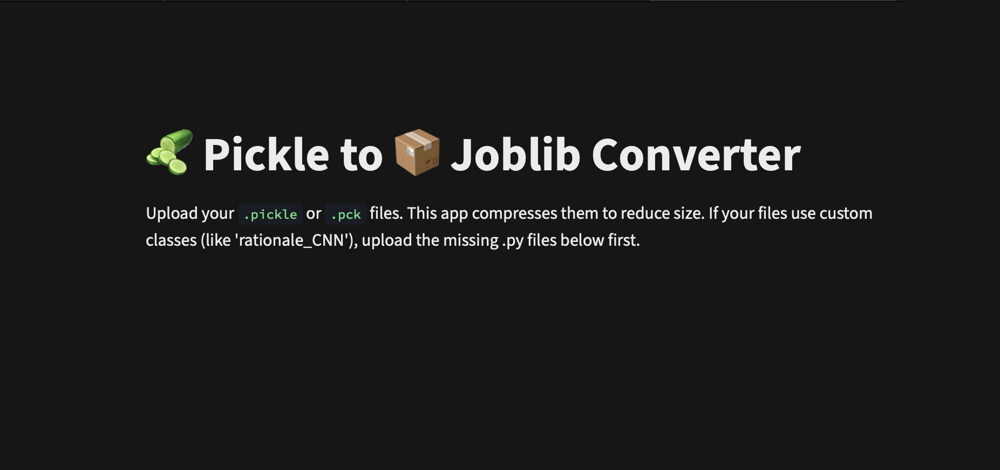

As the name suggests, this tool converts `.pickle` / `.pkl` / `.pck` machine learning model files into compressed `.joblib` files.

It is especially useful for reducing model size, improving loading efficiency, and preparing ML models for deployment.

---

##  Features

* Convert `.pickle` / `.pkl` / `.pck` files to `.joblib`
* Simple Streamlit web interface
* Fast local conversion
* Lightweight and easy to use
* Useful for ML deployment workflows

---

##  Run Locally

### 1. Clone the repository

```bash
git clone https://github.com/RCT-Reviewer/pickle-to-joblib
cd pickle-to-joblib
```

### 2. Create a virtual environment

```bash
python3.13 -m venv .venv
```

### 3. Activate the virtual environment

#### macOS / Linux

```bash
source .venv/bin/activate
```

#### Windows

```bash
.venv\Scripts\activate
```

### 4. Install dependencies

```bash
pip install -r requirements.txt
```

### 5. Run the app

```bash
python -m streamlit run app.py
```

---

## 🌐 Hosted Version

You can also use the hosted online version without installing anything locally.

© aurumz-rgb 2025 – AGPL-3.0 License.

[aurumz-rgb's GitHub](https://github.com/aurumz-rgb)